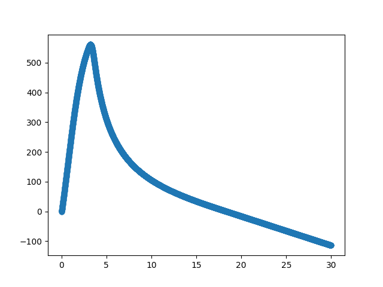

# 1D Rocket Flight Simulator

This repository contains a python based rocket flight simulation script that takes motor thrust and rocket drag data to figure out:

- Rocket Height during flight

- Rocket Velocity during flight

- Total Force on rocket during flight

- Drag force on rocket during flight

- Reynolds Number of flow over rocket during flight

- Rocket Weight over flight

- Thrust from motor over flight

- Expected Pressure at Rocket Altitude during flight

All of these quantities are based on time and are graphable in the script.

it must be noted that this script assumes the rocket travels perfectly perpendicular to the ground and is a 1D solution.

This script was originally meant for the Cardiff University EUROC project that was worked on with the TECSOC Society. Unfortunately, that project fell through and did not happen. I hope to share this script for anyone who wants to use/ improve it. 

# Prerequisites

The following software/ python packages are required if you want to use this script.

- [Python 3](https://www.python.org/)

- [Matplotlib](https://matplotlib.org/)

# How It works

This section details how the script should be used by a users. The Theory behind the script is in the theory section of this read me.

## Preparations for the Script

### Motor Thrust Data

Motor thrust data can be obtained from [thrustcurve.org](https://www.thrustcurve.org/). This website has raw graph
data on a variety of motors from different brands. By finding the motor you want to use you can retrieve thrust data for the burn time of the motor. You can also use a custom built motor as long as you know the thrust over time.

For thrust, the data must be set up in a table with the time in the first column and the thrust in newtons in the second column for every time instance available. The script will find the burn time by looking at the final instance. This table will need to be in a csv file with a "," delimiter.

The table will look something like the one bellow:

| 0     | 0        |
|:-----:|:--------:|
| 0.035 | 721.412  |
| 0.081 | 1110.118 |
| etc.  | etc.     |
| 3.685 | 36.235   |
| 3.731 | 0        |

The csv file name must be inputted in the input section of the script and should be in the folder of the script. An example is provided in the repository.

### Rocket Drag Data

The Rocket drag data uses the relationship between the [Reynolds Number](https://www.engineeringtoolbox.com/reynolds-number-d_237.html) and the [Drag Coefficient](https://www.engineeringtoolbox.com/drag-coefficient-d_627.html) to find the drag on the rocket. This script also requires the rocket area and length entering into the input section at the top of the script to solve for the drag at each time step of flight. For more information on the theory behind this please read the theory section.

When you have the Reynolds numbers and Drag coefficients you must setup a table in a csv format with a delimiter of a ",". The first column must be the Reynolds number with the second being the drag force coefficient. Ideally the highest Reynolds number and drag force coefficient pair in the table should exceed the maximum expected Reynolds number the rocket will experience.

The table will look something like the one bellow:

| 69827.87527 | 0.017717333 |
|:-----------:|:-----------:|
| 1396557.505 | 0.008624353 |
| etc.        | etc.        |
| 51615017    | 0.005702216 |
| 58066894    | 0.005651885 |

The csv file name must be inputted in the input section of the script and should be in the folder of the script. An example is provided in the repository.

### Other Inputs

The script requires a few other inputs to work correctly that are not related to the motor thrust and rocket drag data.

The first two are related to the rocket mass. The initial rocket mass and propellent mass are required to find the weight on the rocket during different flight times. Both of the units should be in kilograms. This data can be found at the manufactures website or it could be at [thrustcurve.org](https://www.thrustcurve.org/).

The Last two are related to the time steps that the script will use for the [Euler Method](https://en.wikipedia.org/wiki/Euler_method). The first is the total flight time we want to predict given in seconds. The second is related to the total number of time iterations we want to make. The higher the time iterations the better the resolution of all quantities found. However the more time iterations the longer each script run will be.

## Script Outputs

The script can output a variety of properties of the rocket flight as described in the beginning section. To get these properties to output or display a graph. You must edit the `plt.scatter(TimeStep, [Property goes here])` line near the end of the script. You can also make edits to the script to generate more than one graph using the same syntax. Just remember to add `plt.show` to display the chart generated.

The chart look something like the one bellow which is an example chart of the rocket velocity against time of flight.

# Theory

The following section details the theory behind the script and how it calculates many of the quantities of the rocket during flight.

## Euler Method

A fundamental concept used in this script is the [Euler Method](https://en.wikipedia.org/wiki/Euler_method). This method allows us to predict some of the properties of the rocket throughout flight by using very small time steps. This is normally accurate enough given sufficient time steps but, it can get more complex. If we take FU as a function, and i as a specific time step, we can define the fundamental equation that is used to predict some of the properties:

$FU_{i+1} = FU_i+\Delta t \times \frac{dFU(t)}{dt}|_{t=t_i}$

The idea is that by looking at the previous value of the property and adding the change to that property with respect to time, you can predict the value of the property at the next time step. The main parts where this is used is for velocity and height prediction. For Specific equations they will be mentioned in the relevant theory sub section.

## Linear Interpolation

Another fundamental concept in this script is [linear interpolation](https://en.wikipedia.org/wiki/Linear_interpolation). This allows the prediction of what a property would be that lies between two known points. This allows us to be able to have only a few combinations of drag and Reynolds numbers for the rocket and a few combinations for the thrust vs time of the motor.

Lets say that $y$ is a property of the rocket that we want to know and $x$ is the property that we know which is related to $y$ (eg. $y$ = thrust, $x$ = time from motor ignition). Lets say that we also know $x_0$ and it's related $y$ value $y_0$ where $x_0 < x$. Lets say we also know $x_1$ and it's associated $y$ value $y_1$ where $x_1 > x$. Knowing all this the equation bellow can be produced.

$y = y_0 + (y_1-y_0)(\frac{x-x_0}{x_1-x_0})$

This equation is used to get the drag coefficient and motor thrust data for each time step of flight.

## Atmospheric Pressure Data

To solve for the atmospheric Pressure at different altitudes, a general equation is used. This general equation  defined as:

$P = 101325(1-2.25577 \times 10^{-5} \times h)^{5.25588}$

Where $P$ is pressure and $h$ is height from sea level. The script does assume the rocket starts are sea level.

This equation has come from [Engineering tool box Atmospheric Pressure vs. Elevation above Sea Level](https://www.engineeringtoolbox.com/air-altitude-pressure-d_462.html) sub page.

## Force Calculations

This section details how all the forces on the rocket are solved for. For the forces it must be noted that a positive force has been taken as vertically upwards. There is no consideration for forces that may act sideways to the rocket (eg. wind) and the rocket is being assumed the travel perfectly perpendicular to the ground level.

### Motor Thrust (TM)

Motor thrust (TM) is provided by the user to the script as detailed in the Motor Thrust Data section. Through the use of linear interpolation, a user does not have to provide thrust data for each time step. They only need a sufficient amount of time steps to accurately predict the motor thrust output for each time step of it's burn time. After the motor has completed it's burn, the script ignores this force.

### Rocket Weight (W)

The changing rocket weight (W) is accounted for in the script by assuming the propellant burns off at a constant rate. To find the weight of the rocket for each time step, a comparison is made to find out if the propellant has fully burned off or not. This is through time from motor ignition ($T$) and total burn time ($B_T$). Using the initial rocket mass ($M_I$) which includes the burnable propellant mass and the mass of burnable propellant ($M_P$) provided by the user. The Weight of the rocket can be found for any time step.

For $T < B_{T}$ Then $W_{T} = g(M_I - M_P(\frac {T}{B_T}))$

For $T \geq B_{T}$ Then $W_T = g(M_I - M_P)$

Where $g =9.81=$ Gravity and $W_T$ is the rocket weight at a specific time step.

### Drag Force (DF)

To find the drag force, the [drag equation](https://en.wikipedia.org/wiki/Drag_(physics)) with the relationship between the drag coefficient of the rocket and the Reynolds number of the flow used. Therefore, for each time step we need to gather properties of the flow to find the Reynolds number to give us the appropriate drag coefficient to then use in the drag equation.

To find the [Reynolds number](https://en.wikipedia.org/wiki/Reynolds_number) of the flow the rocket is experiencing, we have to define some flow properties.

To define the density ($\rho$) of the air that the rocket is flying through, standard air density data is taken from [Engineering Tool Box - Air Altitude Page](https://www.engineeringtoolbox.com/air-altitude-density-volume-d_195.html). This data is used to make a table in the Density Function which is linearly interpolated when relevant to find the density at the defined rocket height.

The fluid velocity (U) is assumed to be the same as the rocket velocity.

The characteristic Length (L) is taken as the length of the rocket. From the tip of the nose to the furthest part back.

Lastly, the dynamic Viscosity ($\mu$) of the air is standard data taken from [Engineering tool box - U.S. Standard Atmosphere vs. Altitude page](https://www.engineeringtoolbox.com/standard-atmosphere-d_604.html). This data is used to make a table in the Viscos function which is linearly interpolated when relevant to find the viscosity of the air at the rockets height.

Using these properties the Reynolds Number is found using the equation bellow:

$Re = \frac {\rho U L}{\mu}$

Now that the Reynolds number is known, the associated drag coefficient ($C_D$) can be found using the provided table data from the user and linear interpolation where appropriate.

At this point most properties in the [drag equation](https://en.wikipedia.org/wiki/Drag_(physics)) are defined. The final property to define is the surface area (A) which is being defined as the outer surface area of the rocket.

Now that all properties are defined. The Drag force equation is defined by:

$D_F = \frac {\rho U^2 A C_D}{2}$

### Total Force(FT)

To find the total force on the rocket. A comparison is made to find out if the propellant has fully burned off or not. This is through time from motor ignition (T) and total burn time (BT). Then, using the forces of Rocket Weight (W), Drag Force (Df) motor thrust (TM) solved already for the specific time step, we can find the total force (FT).

For $T < B_T$ Then $F_t = T_M - W - D_F$

For $T \geq B_T$ Then $F_T = -1(W+D_F)$

## Rocket Velocity

To find the rocket velocity ($V$) for each time step Euler's method and the [SUVAT](https://www.ncl.ac.uk/webtemplate/ask-assets/external/maths-resources/mechanics/kinematics/equations-of-motion.html) equations are used. From the SUVAT equations we can solve for the final velocity after constant acceleration through $V_{i+1}=V_i + at$, where $V_{i+1}$ is the final velocity, $V_i$ is the initial velocity, a is the constant acceleration and t is the time this has taken place in. This can be adapted to Euler's method by redefining it slightly for a small time step instead of a large one $V_{i+1}=V_i + \frac{dv(t)}{dt}$.

$\frac{dv(t)}{dt}$ is acceleration for a small time step which is equivalent to $a = \frac{F}{M} = \frac{V_{i+1} + V_i}{t}$.

These equations come from the [Impulse Equation](https://www.ncl.ac.uk/webtemplate/ask-assets/external/maths-resources/mechanics/dynamics/impulse-and-momentum.html) $F=\frac{M(V_{i+1} + V_i)}{t}$.

If $dt$ is small enough the prediction of the velocity change between time steps will be sufficiently accurate.

From all of this an equation can be produced to find the next time steps rocket velocity:

$V_{i+1} = V_i + dt (\frac{F_{Ti}}{W_i /g})$

where $dt$ is the time step. And $W_i / g$ gives the rocket mass.

## Rocket Height (h)

To find the rocket height between each iteration, Euler's method is also used. The equation is defined as:

$h_{i+1} = h_i + \frac{dh(t)}{dt}$ 

where $\frac{dh}{dt} = V_i$

Therefore, as long as $dt$ is sufficiently small the following equation can be used to find the rocket height between each time step.

$h_{i+1} = h_i + dt(V_i)$ 

# Nomenclature

Some abbreviations have been made in this read me. This section details what they all are.

| Letters       | Meaning                                       |
|:-------------:|:---------------------------------------------:|
| P             | Pressure                                      |
| h             | Height from Sea Level                         |
| TM | Motor Thrust                                  |
| W             | Rocket Weight                                 |
| FU            | Function                                      |
| t             | time                                          |
| $M_I$         | Initial Rocket mass including propellant mass |
| $M_P$         | Burnable propellant mass                      |
| $W_T$         | Rocket Weight at specific Time Step           |
| $g$           | Gravity = 9.81                                |
| Re            | Reynolds Number                               |
| $D_F$         | Drag Force                                    |
| $\rho$        | Density                                       |
| U             | Fluid Velocity                                |
| L             | characteristic Length                         |
| $C_D$         | Drag Coefficient                              |
| V             | Rocket Velocity                               |
| i             | Specific time step of a quantity eg. velocity |
| h             | Rocket Height                                 |
